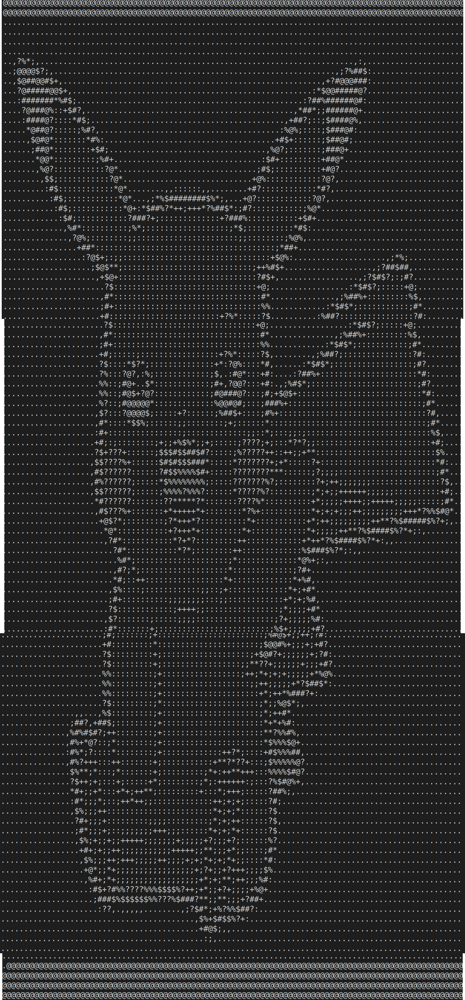

# IMASCII
Converts normal image to ascii pattern

## Installation
- `pip3 install -r requirements.txt`    
- `python3 imascii.py`

## Output
Input Image                |  Output ASCII Pattern
:-------------------------:|:-------------------------:
   |   
